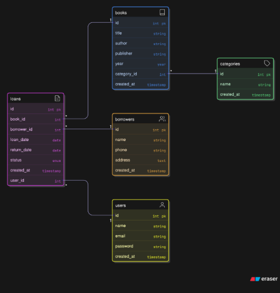

# MinjemDong 📚

Aplikasi manajemen perpustakaan *full-stack* berbasis web dengan React, Express, dan PostgreSQL.

---

## Tech Stack

| Layer | Teknologi |
|---|---|
| Frontend | React 19, Vite, React Router v7, Bootstrap 5, Axios, ApexCharts |
| Backend | Node.js, Express 5, PostgreSQL (`pg`), Multer, JWT, Bcrypt |
| Database | PostgreSQL |

---

## Struktur Proyek

```text
Project-fullstack-kell-7/
├── backend/
│   ├── src/
│   │   ├── config/         # Koneksi database & bootstrap schema
│   │   ├── controllers/    # Handler HTTP (auth, book, borrower, category, loan, user)
│   │   ├── middleware/     # Autentikasi JWT, upload file (Multer), error handler
│   │   ├── models/         # Query langsung ke PostgreSQL
│   │   ├── routes/         # Definisi endpoint REST API
│   │   ├── app.js          # Konfigurasi Express (CORS, static files, routing)
│   │   └── server.js       # Bootstrap database & HTTP server
│   ├── uploads/            # Folder penyimpanan cover buku
│   ├── create-admin.js     # Script one-time untuk membuat akun admin pertama
│   ├── .env.example        # Template environment variables
│   └── package.json
│
├── frontend/
│   ├── src/
│   │   ├── components/
│   │   │   ├── common/     # Komponen lintas halaman (tombol, modal, dsb.)
│   │   │   ├── landing/    # Section landing page
│   │   │   └── layout/     # Navbar, footer, dan public layout
│   │   ├── config/         # Konfigurasi global (base URL, dsb.)
│   │   ├── context/        # State autentikasi (AuthContext)
│   │   ├── data/           # Data demo / statis
│   │   ├── hooks/          # Custom hooks (reusable UI logic)
│   │   ├── pages/          # Komponen halaman (lihat daftar halaman di bawah)
│   │   ├── routes/         # Konfigurasi React Router
│   │   ├── services/       # Fungsi akses API (Axios)
│   │   └── styles/         # Stylesheet aplikasi & per-halaman
│   ├── index.html
│   └── package.json
│
├── perpustakaan.sql        # Dump skema & data awal database
└── erd_perpustakaan.png    # Entity Relationship Diagram
```

---

## Halaman Frontend

| Halaman | Path | Akses |
|---|---|---|
| Landing / Home | `/` | Publik |
| Login | `/login` | Publik |
| Register | `/register` | Publik |
| Katalog Buku | `/books` | Publik |
| Daftar Peminjaman Saya | `/loans` | User login |
| Buku Saya | `/my-books` | User login |
| Pengembalian | `/returns` | User login |
| Dashboard | `/dashboard` | Admin |
| Kelola Buku | `/manage/books` | Admin |
| Kelola Kategori | `/manage/categories` | Admin |
| Kelola Peminjaman | `/manage/loans` | Admin |
| Kelola Pengembalian | `/manage/returns` | Admin |
| Kelola Anggota | `/manage/members` | Admin |

---

## API Endpoints

Base URL: `http://localhost:3000/api`

> 🔒 = memerlukan token JWT (`Authorization: Bearer <token>`)
> 👑 = khusus Admin

### Auth
| Method | Endpoint | Keterangan |
|---|---|---|
| `POST` | `/auth/register` | Daftar akun baru |
| `POST` | `/auth/login` | Login & dapatkan token |

### Buku (`/books`)
| Method | Endpoint | Keterangan |
|---|---|---|
| `GET` | `/books` | Semua buku (publik) |
| `GET` | `/books/auth-picks` | Rekomendasi buku (publik) |
| `GET` | `/books/landing-picks` | Buku pilihan landing page (publik) |
| `GET` | `/books/:id` | Detail buku (publik) |
| `POST` | `/books` | Tambah buku 🔒👑 |
| `PUT` | `/books/:id` | Edit buku 🔒👑 |
| `PATCH` | `/books/:id/status` | Ubah status buku 🔒👑 |
| `DELETE` | `/books/:id` | Hapus buku 🔒👑 |

### Kategori (`/categories`)
| Method | Endpoint | Keterangan |
|---|---|---|
| `GET` | `/categories` | Semua kategori |
| `GET` | `/categories/:id` | Detail kategori |
| `POST` | `/categories` | Tambah kategori 🔒👑 |
| `PUT` | `/categories/:id` | Edit kategori 🔒👑 |
| `DELETE` | `/categories/:id` | Hapus kategori 🔒👑 |

### Peminjaman (`/loans`)
| Method | Endpoint | Keterangan |
|---|---|---|
| `GET` | `/loans/my` | Peminjaman milik akun login 🔒 |
| `GET` | `/loans` | Semua riwayat pinjaman 🔒👑 |
| `GET` | `/loans/:id` | Detail pinjaman 🔒👑 |
| `POST` | `/loans` | Buat peminjaman baru 🔒👑 |
| `PATCH` | `/loans/:id/status` | Update status pinjaman 🔒👑 |
| `DELETE` | `/loans/:id` | Hapus data pinjaman 🔒👑 |

### Anggota / Peminjam (`/borrowers`)
| Method | Endpoint | Keterangan |
|---|---|---|
| `GET` | `/borrowers` | Semua anggota 🔒👑 |
| `GET` | `/borrowers/:id` | Detail anggota 🔒👑 |
| `POST` | `/borrowers` | Tambah anggota 🔒👑 |
| `PUT` | `/borrowers/:id` | Edit anggota 🔒👑 |
| `PATCH` | `/borrowers/:id/status` | Ubah status anggota 🔒👑 |
| `DELETE` | `/borrowers/:id` | Hapus anggota 🔒👑 |

### Pengguna (`/users`)
| Method | Endpoint | Keterangan |
|---|---|---|
| `GET` | `/users` | Semua user 🔒👑 |
| `GET` | `/users/:id` | Detail user 🔒👑 |
| `POST` | `/users` | Tambah user 🔒👑 |
| `PUT` | `/users/:id` | Edit user 🔒👑 |
| `DELETE` | `/users/:id` | Hapus user 🔒👑 |

---

## Konfigurasi Environment

Salin `backend/.env.example` menjadi `backend/.env` lalu isi sesuai environment lokal:

```env
PORT=3000
DB_USER=postgres
DB_PASSWORD=your_password
DB_HOST=localhost
DB_PORT=5432
DB_NAME=perpustakaan
JWT_SECRET=your_secret_key
```

---

## Menjalankan Aplikasi

### Prasyarat
- Node.js >= 18
- PostgreSQL >= 14

### Langkah-langkah

1. **Siapkan database**

   ```sql
   -- Buat database terlebih dahulu
   CREATE DATABASE perpustakaan;
   ```

   Lalu import skema:

   ```bash
   psql -U postgres -d perpustakaan -f perpustakaan.sql
   ```

2. **Konfigurasi backend**

   ```bash
   cd backend
   cp .env.example .env
   # Edit .env sesuai konfigurasi PostgreSQL masing-masing
   npm install
   ```

3. **Buat akun admin pertama** *(opsional, jika belum ada di dump SQL)*

   ```bash
   node create-admin.js
   ```

4. **Jalankan backend**

   ```bash
   npm run dev
   # Backend berjalan di http://localhost:3000
   ```

5. **Jalankan frontend** *(terminal baru)*

   ```bash
   cd frontend
   npm install
   npm run dev
   # Frontend berjalan di http://localhost:5173
   ```

Frontend menggunakan variabel `VITE_API_BASE_URL` bila tersedia, dan fallback ke `http://localhost:3000` secara default.

---

## Pemeriksaan Sintaks

```bash
# Frontend
cd frontend
npm run check

# Backend
cd backend
npm run check
```

---

## ERD Database


